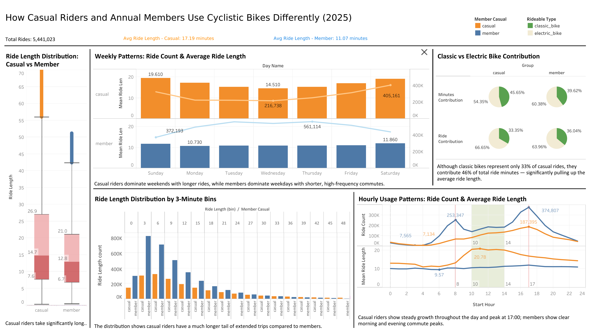

# PROJECT_REPORT.md
**Cyclistic Bike-Share Analysis – Full Process Documentation**  
Google Data Analytics Professional Certificate Capstone Project

---

## Ask

### Business Task
As a junior data analyst on the Cyclistic marketing team, the goal is to analyze Cyclistic’s historical trip data to identify how annual members and casual riders use Cyclistic bikes differently. These insights will support the design of a new marketing strategy aimed at converting casual riders into annual members, which has been identified by the finance team as the most profitable customer segment and the key driver for future company growth.

### Key Stakeholders
- **Primary**: Lily Moreno (Director of Marketing)  
- **Secondary**: Cyclistic Executive Team  
- **Internal**: Cyclistic Marketing Analytics Team

---

## Prepare

### Data Sources
The data used for this analysis is Cyclistic’s historical bike trip data, made publicly available by Motivate International Inc. under a license that permits exploration of customer usage patterns.

- **Source**: Divvy trip data (Cyclistic is a fictional brand name used in the case study; the actual data comes from Divvy Bikes in Chicago)  
- **Location**: https://divvy-tripdata.s3.amazonaws.com/index.html  
- **Time period**: January 2025 to December 2025 (12 monthly CSV files)  
- **File format**: CSV (zipped)  
- **Key variables**: `ride_id`, `rideable_type`, `started_at`, `ended_at`, `start_station_name`, `start_station_id`, `end_station_name`, `end_station_id`, `start_lat`, `start_lng`, `end_lat`, `end_lng`, `member_casual`  
- **Note**: Rider personally identifiable information is not included due to data privacy regulations.

**Special Note on Data Period**  
Due to an upload error in the official Divvy S3 bucket (the January 2026 file contained duplicated January 2025 data), the analysis uses the complete and verified 12-month period from January 2025 to December 2025 (5,552,092 total records before cleaning).

### Data Quality Check (Before Merging)
The 12 monthly CSV files (202501–202512) were individually inspected prior to merging.  

- All files share **identical column data types**.  
- Missing values are concentrated in `start_station_name`, `start_station_id`, `end_station_name`, and `end_station_id` columns (approximately 17–20%).  
- These missing values do not affect the core analysis variables (`ride_id`, `started_at`, `ended_at`, `member_casual`, coordinates).  

**ROCCC Assessment**  
- **Reliable** – Official data collected by the bike-share system  
- **Original** – First-party trip records  
- **Comprehensive** – Covers all trips in the service area for the selected period  
- **Current** – Uses the most recent 12 months available at the time of analysis  
- **Cited** – Properly attributed to Motivate International Inc.

**Output Files Generated**  
- `data/processed/dtype_comparison.csv` and `missing_percentage_comparison.csv` (quality check results)
---

## Process

### Documentation of Cleaning and Data Manipulation

The following cleaning and transformation steps were performed on the merged dataset (`cyclistic_trips_12months.csv`, 5,552,092 rows) to prepare the data for analysis.

#### 1. Initial Data Cleaning and Feature Engineering
- Removed duplicate `ride_id` records (0 duplicates found).
- Converted `started_at` and `ended_at` from object to `datetime64[ns]`.
- Created `ride_length` column (in minutes) using `(ended_at - started_at).dt.total_seconds() / 60`.
- Created `day_of_week` column (1 = Sunday, 7 = Saturday) using pandas `.dt.weekday` adjusted to match Excel WEEKDAY function.
- Filled missing values in `start_station_name`, `start_station_id`, `end_station_name`, and `end_station_id` with "Unknown".

**Result**: Cleaned file `cyclistic_trips_cleaned.csv` with 5,552,092 rows and 15 columns. No rows were deleted at this stage.

#### 2. Removal of Invalid Records
- Removed rows where `ride_length` ≤ 0 (clear data errors).  
  → 29 rows removed (0.001%).

**Result**: Dataset reduced to 5,552,063 rows.

#### 3. Missing Value Analysis (Station Information)
A comparison was conducted between records with missing station information (filled as "Unknown") and records with complete station data.

- Total records: 5,552,063   
- Records with missing station data: 1,862,960 (**33.55%**)

**Key Findings**:
- Missing station records are overwhelmingly electric bike rides (**99.69%**).
- Ride length, member_casual proportion, and day_of_week distribution show only minor differences between the two groups.

**Decision**: Retained all records with station = "Unknown". 
*Note*: Removing these records would disproportionately eliminate electric bike data (99.69% of missing records are electric, while electric bikes only represent 64.93% of the total dataset), creating severe bias in any analysis involving `rideable_type`.

#### 4. Outlier Analysis and Treatment (ride_length)
Outliers were examined using both Tableau visualizations (box plots and histograms) and Python group-specific percentile calculations (1% and 99% percentiles, calculated separately for casual and member riders).

**Key Findings**:
- Outlier records identified: 111,040 (**2.00%**)
- Perfectly balanced between groups: Casual (40,000 rows, 2.0%), Member (71,040 rows, 2.0%)
- Outliers have extremely high mean ride length (154.53 minutes) compared to non-outliers (13.27 minutes).
- Removing outliers reduces overall mean ride length from 16.10 to 13.27 minutes, while the median remains stable at 9.44 minutes.

**Decision**: Removed the 111,040 outliers using group-specific 1% and 99% percentiles. This is a data-driven decision that preserves the natural behavioral difference between casual and member riders while eliminating extreme errors.

#### Final Cleaned Dataset
- **File name**: `cyclistic_trips_final.csv`
- **Total rows**: 5,441,023
- **Total columns**: 15
- All original raw files remain untouched in the `data/raw/` folder.

**Output Files Generated**  
- `data/processed/missing_value_day_of_week_prop.csv`
- `data/processed/missing_value_member_casual_prop.csv`
- `data/processed/missing_value_ride_length_stats.csv`
- `data/processed/missing_value_rideable_type_prop.csv`
- `data/processed/outlier_count_by_group.csv`
- `data/processed/ride_length_outlier_impact.csv`
- `data/processed/ride_length_outlier_stats.csv`
- `data/processed/ride_length_percentiles_by_group.csv`

---

## Analyze

### Summary of Key Analysis

The analysis examined ride length, temporal patterns (day of week and start hour), and rideable type to identify behavioral differences between casual riders and annual members.

#### 1. Overall Ride Length Comparison
Casual riders consistently take significantly longer trips than annual members.

**Ride Length Statistics - Overall vs Casual vs Member**

| Member Type | Count     | Mean   | Std    | Min   | 25%   | 50%   | 75%    | Max    |
|-------------|-----------|--------|--------|-------|-------|-------|--------|--------|
| Overall     | 5,441,023 | 13.27  | 13.08  | 0.22  | 5.47  | 9.44  | 16.36  | 132.49 |
| Casual      | 1,960,084 | 17.19  | 17.96  | 0.22  | 6.39  | 11.41 | 20.85  | 132.49 |
| Member      | 3,480,939 | 11.07  | 8.49   | 0.30  | 5.10  | 8.59  | 14.36  | 51.18  |

Casual riders show a much longer tail in the ride length distribution, indicating a stronger preference for extended trips.  
*(See corresponding Box Plot and Histogram in the Share section)*

#### 2. Weekly Patterns (Day of Week)
Casual riders exhibit a strong U-shaped pattern: both ride count and average ride length peak on weekends and drop noticeably during weekdays. Annual members show the opposite trend — highest ride frequency on weekdays with relatively stable, shorter ride lengths.

**Key Insights**:
- Casual riders dominate weekends (Sunday: 324,654 rides, mean 19.61 min; Saturday: 405,161 rides, mean 19.13 min).
- Annual members dominate weekdays (peaking on Thursday: 561,114 rides).
- The largest gap in ride length occurs on weekends.

*(See corresponding Weekly Patterns visualization in the Share section)*

#### 3. Hourly Patterns (Start Hour)
Casual riders show a steady, continuous increase in ride volume from early morning, peaking only at 17:00. Annual members exhibit clear commuting peaks in the morning (7–9 AM) and evening (17:00).

**Key Insights**:
- Peak hour for both groups: 17:00 (Member: 374,807 rides; Casual: 187,395 rides).
- Midday (10:00–14:00) is when casual riders take their longest trips (mean 20.04–20.78 minutes).
- Members maintain consistently shorter rides (9–12 minutes) throughout the day.

*(See corresponding Hourly Usage Patterns visualization in the Share section)*

#### 4. Rideable Type Analysis (Classic vs Electric)
Although the overall proportion of classic and electric bikes is similar between the two groups, a significant behavioral difference appears among casual riders.

**Rideable Type Statistics**

| Rideable Type   | Member Type | Ride Count | Percentage | Mean Ride Length | Median Ride Length |
|-----------------|-------------|------------|------------|------------------|--------------------|
| Classic Bike    | Overall     | 1,908,260  | 35.07%     | 16.06            | 10.92              |
| Classic Bike    | Casual      | 653,723    | 33.35%     | 23.53            | 15.92              |
| Classic Bike    | Member      | 1,254,537  | 36.04%     | 12.17            | 9.12               |
| Electric Bike   | Overall     | 3,532,763  | 64.93%     | 11.77            | 8.79               |
| Electric Bike   | Casual      | 1,306,361  | 66.65%     | 14.02            | 9.75               |
| Electric Bike   | Member      | 2,226,402  | 63.96%     | 10.45            | 8.32               |

**Key Insight**:  
Classic bikes represent only 33.35% of casual rides, yet they contribute **45.65%** of total ride minutes among casual riders. This small proportion of classic bike usage is the primary driver pulling the overall casual rider average ride length upward (from 14.02 minutes on electric to 17.19 minutes overall).

*(See corresponding Rideable Type Contribution visualization in the Share section)*

---

### Summary of Analysis
The analysis of Cyclistic’s 2025 trip data reveals clear and consistent behavioral differences between casual riders and annual members across multiple dimensions.

Casual riders consistently take significantly longer trips than annual members. Temporal patterns further highlight contrasting usage purposes: annual members exhibit classic commuting behavior with high ride frequency on weekdays and clear morning/evening peaks, while casual riders show a strong U-shaped weekly pattern with both ride count and ride length peaking on weekends and during midday hours. Regarding rideable type, although electric bikes dominate overall usage, classic bikes play a disproportionately important role for casual riders by significantly increasing their average ride length.

**In summary**, annual members primarily use Cyclistic bikes for short, routine weekday commuting, while casual riders favor longer, leisure-oriented rides, particularly on weekends and during daytime hours, often selecting classic bikes when they want extended journeys. These distinct patterns provide a strong foundation for developing targeted marketing strategies aimed at converting casual riders into annual members.

---

## Share

### Supporting Visualizations and Key Findings

The following interactive Tableau dashboard was created to present the key findings in a clear, professional, and executive-friendly format.

**Interactive Tableau Dashboard**  
[View Full Interactive Dashboard](https://public.tableau.com/views/CyclisticCaseStudy_17762667207600/Casualriderstakesignificantlylongertripsthanmembers?:language=zh-TW&:sid=&:redirect=auth&:display_count=n&:origin=viz_share_link)

### Key Findings

The analysis reveals consistent and actionable differences between casual riders and annual members:

- **Ride Length**: Casual riders take significantly longer trips than annual members (average 17.19 minutes vs 11.07 minutes). The distribution shows casual riders have a much longer tail of extended trips.

- **Weekly Patterns**: Casual riders dominate weekends with both higher ride counts and longer average ride lengths (Sunday: 19.61 min, Saturday: 19.13 min). In contrast, annual members dominate weekdays with shorter, high-frequency trips, peaking on Thursday (561,114 rides).

- **Hourly Patterns**: Casual riders show a steady increase in ride volume throughout the day, peaking at 17:00. Annual members exhibit clear commuting peaks in the morning (07:00-09:00) and evening (17:00).

- **Rideable Type**: Although electric bikes are the majority for both groups, classic bikes play a disproportionately important role for casual riders. Classic bikes represent only 33.35% of casual rides but contribute 45.65% of total ride minutes, significantly raising the overall average ride length for casual riders.

### Story Told by the Data

Casual riders primarily use Cyclistic bikes for **leisure and recreational purposes** — longer rides on weekends and during midday hours, often choosing classic bikes when they want extended journeys. Annual members primarily use the service for **routine commuting** — short, frequent trips on weekdays with clear morning and evening peaks.

These behavioral differences provide a strong, data-driven foundation for designing targeted marketing strategies to convert casual riders into annual members.

---
